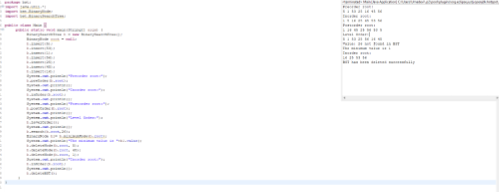

# Thulluru Uma Devi

## Date Time:  11:30 am Wednesday, 23 March 2023 (IST)

## Java Training acquired

> 1. JAVA SWING: Subtle understanding of Swing components and functionalities and their role in creating customized and complex applications. Worked on basic applications such as Calculator, Basic Employee Management System etc., the inclusion of JDBC and OOPS concepts that makes it more custom-oriented and user interactive.
 
> 2. JAVA FX: Basic overview and brief understanding of JAVA FX and its use cases that can be implemented for creating applications. Worked on simple applications such as Calculator,Login Forms and explored various components involved that make the portrayal of the application rich and interactive.
 
> 3. JAVA: Good understanding of OOPS concepts and JDBC.Currently, at a beginner’s level, but constantly working to build and sharpen my skills that can contribute to overall growth.

## Pull Requets process, Continuos Integration and Continuos Delivery

**References**

>1. https://learn.microsoft.com/en-us/azure/devops/repos/git/about-pull-requests?view=azure-devops
>2. https://learn.microsoft.com/en-us/azure/architecture/example-scenario/apps/devops-dotnet-baseline

## Binary Search Tree
> 1. A rooted binary tree data structure with the key of each internal node being greater than all the keys in the respective node's left subtree and less than the ones in its right subtree.

> 

## Installation

> To use this BinarySearchTree, you can follow the steps below:

> 1. Clone the repository. You can also download the zip file and extract it to your preferred directory.
> 2. Open the project in your favorite Java IDE (e.g. Eclipse, IntelliJ IDEA, NetBeans). Ensure that you have installed the necessary dependencies required for the project to run.
> 3. Run the Main file.

## Output

## MYSQL Work Bench

> 1. MySQL Workbench is a visual database design tool and administration tool for MySQL databases. It allows users to visually design, model, create and manage databases. MySQL Workbench provides a graphical user interface (GUI) to perform a variety of tasks such as creating, editing and deleting database objects, executing SQL queries, designing and generating data models, and managing database users and permissions.

*Installing MYSQL:*

> 1. Download the MySQL Installer from the official MySQL website: https://dev.mysql.com/downloads/installer/
> 2. Configure the MySQL Server, including the data directory, port number, authentication method, etc. 

## Connecting JDBC with MYSQL

> 1. Download the MySQL Connector/J JDBC driver from the official MySQL website: https://dev.mysql.com/downloads/connector/j/.
> 2. Add the path to the MySQL Connector/J JAR file to your classpath.

## JDBC CRUD Operations with MYSQL

> 1. Creation of CustomerDB database in MYSQL.
> 2. Creation of a table called Customer, prepopulated with few rows.

*Operations Performed:*

> 1. Update Records
> 2. Update Multiple Records
> 3. Display Records
> 4. Display All Records

*Description*

> 1. update(): used to update a single record 
> 2. updateMultiple(): used to update multiple records according to the user convenience.
> 3. Display(): used to display a single record 
> 4. DisplayAll(): used to update multiple records according to the user convenience.

## Output

